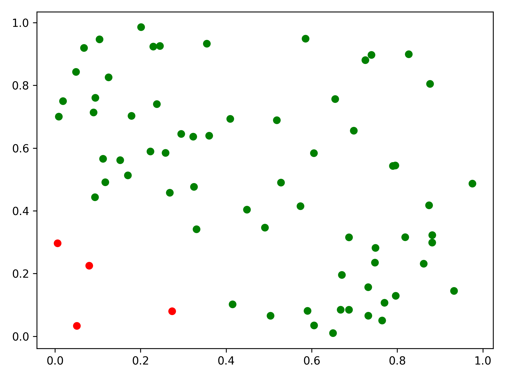
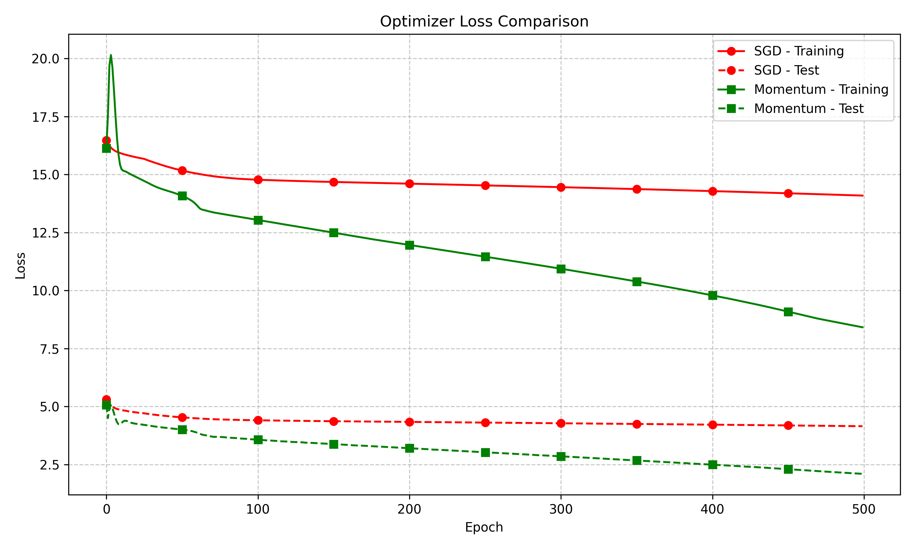

# 基于多层感知机的二分类

这里以多层感知机实现模拟数据的二分类为例，介绍`toydl`的简单使用方法。

## 模拟数据生成

首先生成模拟数据，并将其分割为训练集和测试集：

```python
--8<-- "example/mlp_binary.py:gen_dateset"
```

这里是一个简单的二维平面分割任务的数据：

<p align="center">
  
</p>

## 配置网络结构

```python
mlp_config = MLPConfig(
    in_size=2, out_size=1, hidden_layer_size=10, hidden_layer_num=2
)

mlp_model = MLPBinaryClassifyModel(mlp_config)
```

- 输入层：2维向量
- 输出层：1维向量
- 隐藏层：两层，每层10个神经元

## 训练不同优化器模型

### SGD优化器

```python
def run_sgd(
    mlp_config: MLPConfig,
    training_set: SimpleDataset,
    test_set: SimpleDataset,
    learning_rate: float,
    max_epochs: int = 500,
):
    mlp_model = MLPBinaryClassifyModel(mlp_config)
    sgd_optimizer = SGD(mlp_model.net.parameters(), learning_rate)
    training_loss, testing_loss, test_result = mlp_model.train(
        training_set, test_set, sgd_optimizer, max_epochs=max_epochs
    )
    return training_loss, testing_loss, test_result
```

### Momentum优化器

```python
def run_momentum(
    mlp_config: MLPConfig,
    training_set: SimpleDataset,
    test_set: SimpleDataset,
    learning_rate: float,
    max_epochs: int = 500,
):
    momentum = 0.5
    mlp_model = MLPBinaryClassifyModel(mlp_config)
    optimizer = Momentum(mlp_model.net.parameters(), learning_rate, momentum)
    training_loss, testing_loss, test_result = mlp_model.train(
        training_set, test_set, optimizer, max_epochs=max_epochs
    )
    return training_loss, testing_loss, test_result
```

## 优化器性能对比

通过在一个图表中同时展示不同优化器的训练和测试损失曲线，我们可以直观地比较它们的性能。`plot_multiple_optimizers`函数可以接收多个优化器的训练和测试结果，并将它们绘制在同一张图上进行比较。

## 运行优化器比较

```python
def run():
    n = 100
    training_set, test_set = get_dataset(n)

    mlp_config = MLPConfig(
        in_size=2, out_size=1, hidden_layer_size=10, hidden_layer_num=2
    )

    learning_rate = 0.01
    max_epochs = 500

    # 训练SGD模型
    sgd_training_loss, sgd_testing_loss, sgd_test_result = run_sgd(
        mlp_config, training_set, test_set, learning_rate, max_epochs
    )

    # 训练Momentum模型
    momentum_training_loss, momentum_testing_loss, momentum_result = run_momentum(
        mlp_config, training_set, test_set, learning_rate, max_epochs
    )

    # 比较优化器性能
    optimizer_results = {
        "SGD": (sgd_training_loss, sgd_testing_loss, sgd_test_result),
        "Momentum": (momentum_training_loss, momentum_testing_loss, momentum_result)
    }
    plot_multiple_optimizers(optimizer_results, title="优化器性能对比")
```

运行上述代码后，可以得到如下的优化器性能对比图：

<p align="center">
  
</p>


## MLP完整训练步骤

```python
--8<-- "example/mlp_binary.py:model"
```

## 实验完整代码

??? note "本示例的完整代码: `example/mlp_binary.py`"

    ```python
    --8<-- "example/mlp_binary.py"
    ```
