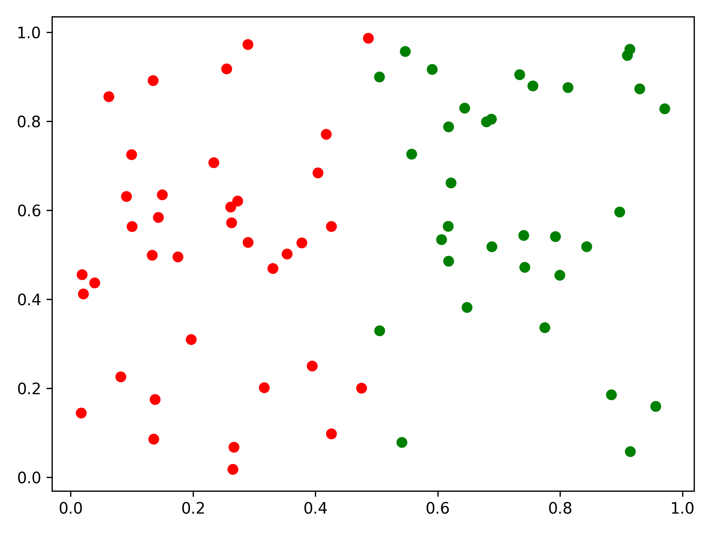
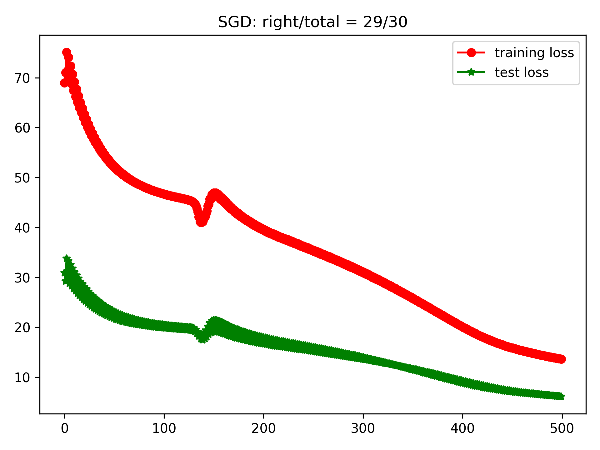
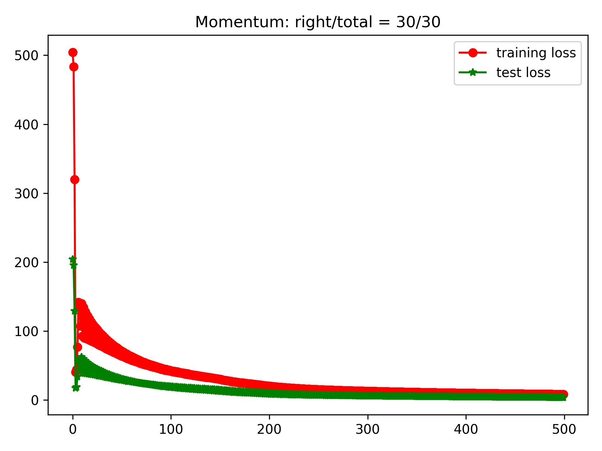

# 基于多层感知机的二分类

这里以多层感知机实现模拟数据的二分类为例，介绍`toydl`的简单使用方法。

## 模拟数据生成

首先生成模拟数据，并将其分割维训练集和测试集

```python
--8<-- "toydl/example/mlp_binary.py:gen_dateset"
```


这里是一个简单的二维平面分割任务的数据

<center>
{: style="height:400px;width:500px"}
</center>


## 配置网络结构

```python
mlp_config = MLPConfig(
    in_size=2, out_size=1, hidden_layer_size=10, hidden_layer_num=2
)

mlp_model = MLPBinaryClassifyModel(mlp_config)
```

- 输入层： 2维向量
- 输出层： 1维向量
- 隐藏层：两层，每层10个神经元


## 训练: SGD优化器

```python
sgd_optimizer = SGD(mlp_model.net.parameters(), learning_rate)

training_loss, testing_loss, test_result = mlp_model.train(
    training_set, test_set, sgd_optimizer, max_epochs=max_epochs
)

mlp_model.plot_loss(
    training_loss, testing_loss, title=f"SGD: {test_result}", filename="sgd.png"
)
```

得到如下的损失曲线

<center>
{: style="height:400px;width:500px"}
</center>

## 训练: Momentum优化器
```python
momentum = 0.5
mlp_model = MLPBinaryClassifyModel(mlp_config)

optimizer = Momentum(mlp_model.net.parameters(), learning_rate, momentum)

training_loss, testing_loss, test_result = mlp_model.train(
    training_set, test_set, optimizer, max_epochs=max_epochs
)
```

得到如下的损失曲线

<center>
{: style="height:400px;width:500px"}
</center>

## MLP完整训练步骤

```python
--8<-- "toydl/example/mlp_binary.py:model"
```


## 实验完整代码

??? note "本示例的完整代码: `toydl/example/mlp_binary.py`"

    ```python
    --8<-- "toydl/example/mlp_binary.py"
    ```
